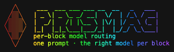

<div align="center">



**One prompt enters. Each block routes to the right model.**

Tag any block with `@@model` and PRISMAG sends it to the model you chose —
planning to Opus, implementation to Composer, summaries to a fast model —
without switching the IDE picker or juggling chats.

[](https://go.dev)
[](LICENSE)
[](https://github.com/rufus-SD/prismag/actions)
[](https://github.com/rufus-SD/prismag/releases)
[](https://github.com/rufus-SD/maind)

</div>

---

```
prismag> @@opus: design the auth flow   @@composer: implement the middleware

  ── @@opus → claude-4.6-opus-high-thinking ───────────────────────────
  Use short-lived access tokens with rotating refresh tokens because…

  ── @@composer → composer-2.5-fast ───────────────────────────────────
  // middleware/auth.go
  func RequireAuth(next http.Handler) http.Handler { … }

  routed 2 blocks · chained · 1.8s
```

## The problem

Today's AI coding tools force a binary choice:

1. Pick **one model** for the whole conversation, or
2. Open **multiple chats** and split the work by hand.

Neither matches how you actually work. Planning wants depth (Opus).
Implementation wants speed (Composer). Review wants a different lens entirely.

| Without PRISMAG | With PRISMAG |
|---|---|
| One model per chat | A model **per block**, in one prompt |
| Switch the picker between tasks | `@@opus:` … `@@composer:` … and go |
| Manual context copy-paste between chats | Output of block N **chains** into block N+1 |
| Auto-routing by cost/latency (OpenRouter) | **You** choose the model per block |
| YAML/Python pipelines (LangGraph/CrewAI) | Chat-native `@@` syntax, zero config |

## How it works

```
Prompt with @@tags ──▶ parser ──▶ orchestrator ──▶ model backends ──▶ sectioned result
                                       ▲
                                       └── ContextStore (in-memory · or maind)
```

- The trigger is **`@@`**, not `@` — a bare `@` collides with the IDE's mention
  menu. `@@` travels as plain text through every chat surface.
- Routing is **deterministic** and owned by the CLI + `registry.yaml`.
- Blocks run **serial + chained** by default (output N → context N+1), or
  `--parallel` for independent blocks.
- Context flows through a pluggable store — in-memory by default, or
  [maind](https://github.com/rufus-SD/maind) for encrypted, cross-session memory.

## Install

```bash
# Go 1.26+
go install github.com/rufus-SD/prismag@latest

# or clone and build
git clone https://github.com/rufus-SD/prismag.git
cd prismag && make install
```

## Setup (2 minutes)

```bash
# 1. Guided onboarding — environment, optional API keys, model discovery, registry
prismag setup

# 2. Wire routing into your editor (auto-detects the tool)
prismag init

# 3. Route a prompt
prismag run "@@opus: plan the cache layer" "@@composer: implement it"
```

Or just run `prismag` with no args to drop into the interactive `prismag>` session.

## Use it anywhere

PRISMAG works in **two ways**, from the same global config:

- **CLI / REPL** — runs in any terminal, on any OS. Executes each block via
  provider APIs using your keys. Universal, deterministic.
- **In your IDE** — `prismag init` writes a rule that teaches the agent to route
  `@@` blocks through PRISMAG. Where the IDE supports per-task subagents, each
  block is dispatched to its own subagent + model using your subscription (no API
  keys needed).

| Editor | Rule file | Dispatch |
|--------|-----------|----------|
| **Cursor** | `.cursor/rules/prismag-routing.mdc` + `.cursor/agents/` | subagents (any model) |
| **Claude Code** | `CLAUDE.md` + `.claude/agents/` | subagents (Claude) + API fallback |
| **Windsurf** | `.windsurf/rules/prismag-routing.md` | runs via `prismag run` |
| **GitHub Copilot** | `.github/copilot-instructions.md` | runs via `prismag run` |
| **Cline** | `.clinerules/prismag-routing.md` | runs via `prismag run` |
| **Roo Code** | `.roo/rules/prismag-routing.md` | runs via `prismag run` |
| **Aider** | `CONVENTIONS.md` | runs via `prismag run` |
| **generic** | `.prismag/rules.md` | runs via `prismag run` |

```bash
prismag connect cursor      # or: claude, windsurf, copilot, cline, roo, aider, generic
```

Subagent dispatch gives true per-block model switching where the editor exposes
it (Cursor, Claude Code). Everywhere else, the agent runs `prismag run` and shows
the sectioned output verbatim — same routing, same result.

## The `@@` DSL

```
@@<alias>: <task>
```

```
context shared with every block goes here, before the first tag

@@opus: review the security implications of this auth module
@@composer: write the unit tests for AuthService
@@fast: summarize the diff in 3 bullets
```

- `@@alias` is case-insensitive and maps to a model via `registry.yaml`.
- Text before the first `@@` is shared context for all blocks.
- **Serial + chained** by default; `--parallel` for independent blocks.
- Chained runs fail fast; parallel runs tolerate partial failure.

### Registry (`registry.yaml`)

```yaml
aliases:
  opus:
    model: claude-4.6-opus-high-thinking
    provider: anthropic
    agent: opus-planner          # subagent used when routing in-IDE
    description: Deep reasoning, architecture, security review
  composer:
    model: composer-2.5-fast
    provider: cursor
    agent: composer-implementer
    description: Fast implementation, multi-file edits
  fast:
    model: gpt-5.3-codex
    provider: openai
    description: Cheap, quick summaries and simple transforms
```

## Commands

| Command | What it does |
|---|---|
| `prismag` | Interactive `prismag>` session (or onboarding on first run) |
| `prismag setup` | First-time setup: keys, model discovery, starter registry |
| `prismag init [tool]` | Wire routing into this project (auto-detects the editor) |
| `prismag connect <tool>` | Write the integration rule (+ subagents where supported) |
| `prismag run "@@..."` | Route and execute a tagged prompt |
| `prismag route "@@..."` | Show the delegation plan without executing (`--json` too) |
| `prismag list` | List `@@aliases` with availability marks |
| `prismag models` | Show models available right now |
| `prismag doctor` | Diagnose keys, registry, and environment |
| `prismag sessions` | List saved REPL session transcripts |
| `prismag resume [id]` | Reopen a past session with its context |

## Credentials & availability

PRISMAG calls provider APIs **directly** — keys go straight to the vendor, never
to a gateway. Keys are read from the environment, a `~/.config/prismag/.env`, or
stored encrypted in [maind](https://github.com/rufus-SD/maind) when present.

```
ANTHROPIC_API_KEY only:            + OPENAI_API_KEY:
  @@opus      ✓ ready                @@opus      ✓ ready
  @@fast      ✗ needs OPENAI_API_KEY @@fast      ✓ ready
```

Inside an IDE that dispatches subagents, blocks route via your subscription —
no API keys required.

## Why no gateway (no LiteLLM)

PRISMAG already *is* the router, so it calls provider REST APIs directly with no
self-hosted proxy, DB, or admin UI to trust and patch. That keeps the
dependency/supply-chain surface tiny — direct APIs, a single static binary.

## Pairs with maind

[maind](https://github.com/rufus-SD/maind) is the optional memory backend: an
encrypted, local-first store the CLI and your IDE agent share. With both wired in,
context survives across blocks, sessions, and editors.

## Contributing

See [CONTRIBUTING.md](CONTRIBUTING.md).

## Security

See [SECURITY.md](SECURITY.md) for credential handling and vulnerability reporting.

## License

[MIT](LICENSE)
